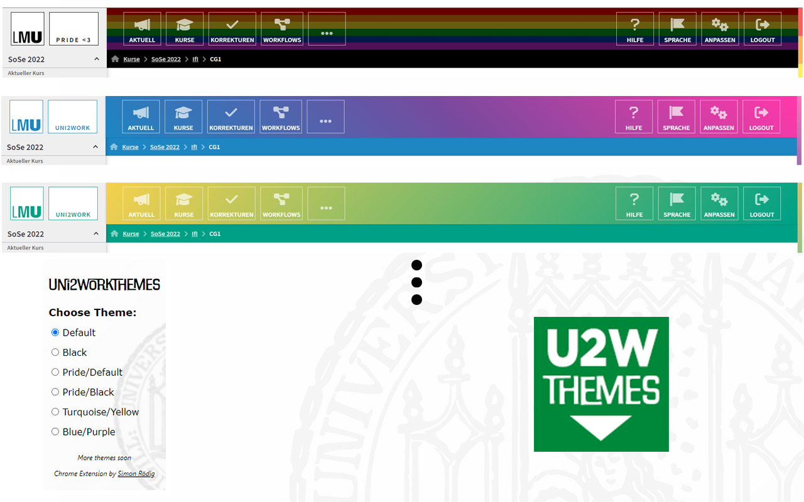

The main platform most students use at the University Of Munich is Uni2Work. During pride-season I noticed students talking about the fact that Uni2Work doesn't appear in a pride-theme with the typical rainbow flag as other websites do during that time. 
As Uni2Works' design is merely a rather monotonous green I decided to programm a general browser extension for chromium which lets users select different themes for this webpage including a pride-theme. After some research on how browser extensions work I finished programming "Uni2WorkThemes" and published the extension in the chrome web store for other students to use.

Short explanation: The popups' HTML is only displayed when the user is on the active tab *://*.uni2work.ifi.lmu.de/*, here the user can select the different themes. On every other website the extensions' popup, when clicked, displays "Go to Uni2Work". By clicking on the different themes a JavaScript file inserts the new CSS within a style-tag into the current HTML-header. The activated theme is then also stored in the browsers' local storage and retreived from different JavaScript files when opening and changing the theme in the popup, and when browsing on Uni2Work. 

Check out my extension on the chrome web store and see for yourself:

-> https://chrome.google.com/webstore/detail/uni2workthemes/jainhimpodibbfonbpdnijmiejalmbko